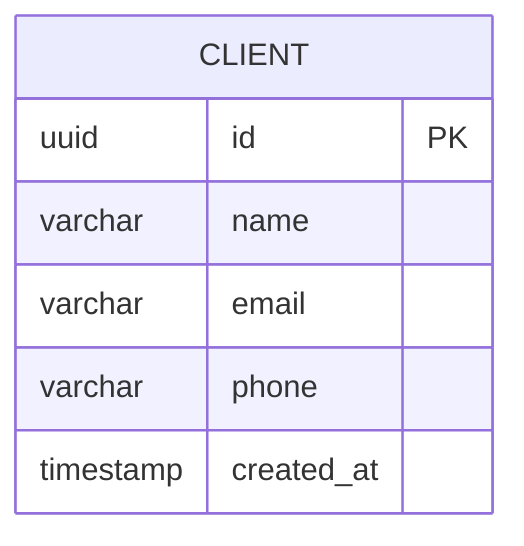

# Modelo de Datos

## Stack
- **Base de Datos**: PostgreSQL 16
- **ORM**: Entity Framework Core 8.0
- **Approach**: Code First (modelos → migraciones → BD)

## Diagrama Entidad-Relación



## Configuración en EF Core

### Client Configuration
```csharp
public class ClientConfiguration : IEntityTypeConfiguration<Client>
{
    public void Configure(EntityTypeBuilder<Client> builder)
    {
        builder.ToTable("clients");
        
        builder.HasKey(c => c.Id);
        
        builder.Property(c => c.Id)
            .HasColumnName("id")
            .HasDefaultValueSql("gen_random_uuid()");
        
        builder.Property(c => c.Name)
            .HasColumnName("name")
            .HasMaxLength(255)
            .IsRequired();
        
        builder.Property(c => c.Email)
            .HasColumnName("email")
            .HasMaxLength(255)
            .IsRequired();
        
        builder.Property(c => c.Phone)
            .HasColumnName("phone")
            .HasMaxLength(50)
            .IsRequired(false);
        
        builder.Property(c => c.CreatedAt)
            .HasColumnName("created_at")
            .HasDefaultValueSql("NOW()");
    }
}
```

## Tablas

### clients
| Columna | Tipo PostgreSQL | Constraints | Descripción |
|---------|-----------------|-------------|-------------|
| id | UUID | PK, DEFAULT gen_random_uuid() | Identificador único |
| name | VARCHAR(255) | NOT NULL | Nombre del cliente |
| email | VARCHAR(255) | NOT NULL, UNIQUE | Correo electrónico |
| phone | VARCHAR(50) | NULL | Teléfono (opcional) |
| created_at | TIMESTAMP | NOT NULL, DEFAULT NOW() | Fecha de creación |

## Índices
- `pk_clients` PRIMARY KEY en `id`
- `idx_clients_email` UNIQUE en `email`
- `idx_clients_name` en `name`

## Migraciones EF Core Code First

### Comandos útiles
```bash
# Crear migración
dotnet ef migrations add AddClientEntity --project src/Infrastructure --startup-project src/Api

# Aplicar migración
dotnet ef database update --project src/Infrastructure --startup-project src/Api

# Eliminar última migración
dotnet ef migrations remove --project src/Infrastructure --startup-project src/Api

# Script de SQL
dotnet ef migrations script --project src/Infrastructure --startup-project src/Api
```

### Convenciones de Migraciones
- Nombre descriptivo: `InitialCreate`, `AddClientEntity`
- Revisar el script SQL antes de aplicar en producción
- Siempre hacer backup antes de migrar en producción

### Aplicación Automática en Primera Ejecución
Las migraciones se aplican automáticamente al iniciar la API vía `Startup.cs:54` `db.Database.Migrate()` (`src/Api/Startup.cs:54`). En la primera ejecución se crean las tablas (`clients`) sin intervención manual. Ver `src/Infrastructure/Migrations/20260923102117_InitialCreate.cs`.

## Conexión a PostgreSQL

### Local (docker-compose / development)
- **Database**: `postgresql-db-ia-tests`
- **Usuario**: `timeforsoftware@gmail.com`
- **Password**: `postgres` (hardcoded para dev)
- **Host**: `postgres` (service docker-compose) o `localhost` (`appsettings.Development.json`)

```json
// src/Api/appsettings.json (local docker-compose)
{
  "ConnectionStrings": {
    "DefaultConnection": "Host=postgres;Port=5432;Database=postgresql-db-ia-tests;Username=timeforsoftware@gmail.com;Password=postgres"
  }
}
// src/Api/appsettings.Development.json (dotnet run local)
{
  "ConnectionStrings": {
    "DefaultConnection": "Host=localhost;Port=5432;Database=postgresql-db-ia-tests;Username=timeforsoftware@gmail.com;Password=postgres"
  }
}
```

### Producción (VPS Debian)
- **Database**: `postgresql-db-ia-tests`
- **Usuario**: `timeforsoftware@gmail.com`
- **Password**: desde secreto `DB_PASSWORD` (GitHub Secrets)
- **Host**: `host.docker.internal` con `--add-host=host.docker.internal:host-gateway` y red `nginx-net`

```bash
# En VPS (ci-cd.yml:110)
-e ConnectionStrings__DefaultConnection="Host=host.docker.internal;Port=5432;Database=postgresql-db-ia-tests;Username=timeforsoftware@gmail.com;Password=${{ secrets.DB_PASSWORD }}"
```
> **Nota**: la contraseña en despliegue viene del secreto `DB_PASSWORD`, no hardcodeada. El nombre de BD y el usuario son fijos; la BD `postgresql-db-ia-tests` y el rol `timeforsoftware@gmail.com` deben existir en el PostgreSQL del VPS.

### DbContext Configuration
```csharp
builder.Services.AddDbContext<ApplicationDbContext>(options =>
    options.UseNpgsql(
        builder.Configuration.GetConnectionString("DefaultConnection"),
        b => b.MigrationsAssembly("Infrastructure")
    ));
```
