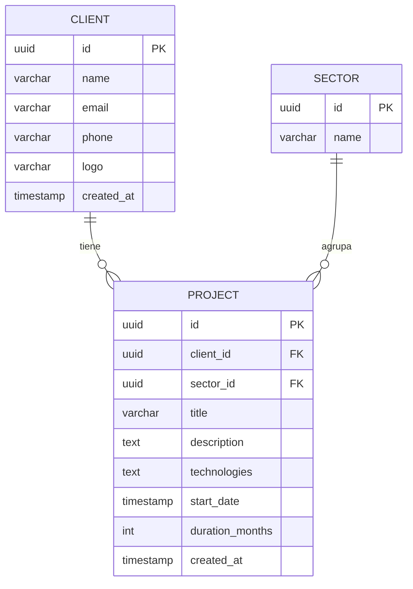

# Modelo de Datos

## Stack
- **Base de Datos**: PostgreSQL 16
- **ORM**: Entity Framework Core 8.0
- **Approach**: Code First (modelos → migraciones → BD)

## Diagrama Entidad-Relación



## Configuración en EF Core

### Client Configuration
```csharp
public class ClientConfiguration : IEntityTypeConfiguration<Client>
{
    public void Configure(EntityTypeBuilder<Client> builder)
    {
        builder.ToTable("clients");
        
        builder.HasKey(c => c.Id);
        
        builder.Property(c => c.Id)
            .HasColumnName("id")
            .HasDefaultValueSql("gen_random_uuid()");
        
        builder.Property(c => c.Name)
            .HasColumnName("name")
            .HasMaxLength(255)
            .IsRequired();
        
        builder.Property(c => c.Email)
            .HasColumnName("email")
            .HasMaxLength(255)
            .IsRequired();
        
        builder.Property(c => c.Phone)
            .HasColumnName("phone")
            .HasMaxLength(50)
            .IsRequired(false);
        
        builder.Property(c => c.Logo)
            .HasColumnName("logo")
            .HasMaxLength(2048)
            .IsRequired(false);

        builder.Property(c => c.CreatedAt)
            .HasColumnName("created_at")
            .HasDefaultValueSql("NOW()");
    }
}
```

### Sector Configuration
```csharp
public class SectorConfiguration : IEntityTypeConfiguration<Sector>
{
    public void Configure(EntityTypeBuilder<Sector> builder)
    {
        builder.ToTable("sectors");

        builder.HasKey(s => s.Id);

        builder.Property(s => s.Id)
            .HasColumnName("id")
            .ValueGeneratedNever();

        builder.Property(s => s.Name)
            .HasColumnName("name")
            .HasMaxLength(100)
            .IsRequired();

        builder.HasIndex(s => s.Name)
            .IsUnique()
            .HasDatabaseName("idx_sectors_name");

        // Catalogo de solo lectura: 7 filas sembradas con id fijo
        builder.HasData(Sector.DefaultCatalog);
    }
}
```

`Sector.DefaultCatalog` (`src/Domain/Entities/Sector.cs`) define los 7 sectores con GUID fijos, de modo que la siembra es idempotente y los ids son estables entre entornos.

### Project Configuration
```csharp
public class ProjectConfiguration : IEntityTypeConfiguration<Project>
{
    public void Configure(EntityTypeBuilder<Project> builder)
    {
        builder.ToTable("projects");

        builder.HasKey(p => p.Id);

        builder.Property(p => p.Id)
            .HasColumnName("id")
            .HasDefaultValueSql("gen_random_uuid()");

        builder.Property(p => p.ClientId)
            .HasColumnName("client_id")
            .IsRequired();

        builder.Property(p => p.SectorId)
            .HasColumnName("sector_id")
            .IsRequired();

        builder.Property(p => p.Title)
            .HasColumnName("title")
            .HasMaxLength(255)
            .IsRequired();

        builder.Property(p => p.Description)
            .HasColumnName("description")
            .HasColumnType("text")
            .IsRequired();

        builder.Property(p => p.Technologies)
            .HasColumnName("technologies")
            .HasColumnType("text")
            .IsRequired();

        builder.Property(p => p.StartDate)
            .HasColumnName("start_date")
            .IsRequired();

        builder.Property(p => p.DurationMonths)
            .HasColumnName("duration_months")
            .IsRequired(false);

        builder.Property(p => p.CreatedAt)
            .HasColumnName("created_at")
            .HasDefaultValueSql("NOW()");

        builder.HasIndex(p => p.ClientId)
            .HasDatabaseName("idx_projects_client_id");

        builder.HasIndex(p => p.SectorId)
            .HasDatabaseName("idx_projects_sector_id");

        builder.ToTable("projects", table =>
            table.HasCheckConstraint("chk_projects_duration_months", "duration_months IS NULL OR duration_months > 0"));

        builder.HasOne<Client>()
            .WithMany()
            .HasForeignKey(p => p.ClientId)
            .OnDelete(DeleteBehavior.Restrict)
            .HasConstraintName("fk_projects_client_id");

        builder.HasOne<Sector>()
            .WithMany()
            .HasForeignKey(p => p.SectorId)
            .OnDelete(DeleteBehavior.Restrict)
            .HasConstraintName("fk_projects_sector_id");
    }
}
```

## Tablas

### clients
| Columna | Tipo PostgreSQL | Constraints | Descripción |
|---------|-----------------|-------------|-------------|
| id | UUID | PK, DEFAULT gen_random_uuid() | Identificador único |
| name | VARCHAR(255) | NOT NULL | Nombre del cliente |
| email | VARCHAR(255) | NOT NULL, UNIQUE | Correo electrónico |
| phone | VARCHAR(50) | NULL | Teléfono (opcional) |
| logo | VARCHAR(2048) | NULL | URL del logo (opcional) |
| created_at | TIMESTAMP | NOT NULL, DEFAULT NOW() | Fecha de creación |

### sectors (catálogo de solo lectura)
| Columna | Tipo PostgreSQL | Constraints | Descripción |
|---------|-----------------|-------------|-------------|
| id | UUID | PK, sin default (valor fijo por sector) | Identificador del sector |
| name | VARCHAR(100) | NOT NULL, UNIQUE | Nombre del sector |

Valores sembrados por la migración (BR-016):

| name | id |
|------|----|
| Administración pública | `11111111-1111-1111-1111-111111111111` |
| Ingeniería | `22222222-2222-2222-2222-222222222222` |
| Publicidad | `33333333-3333-3333-3333-333333333333` |
| Servicios financieros | `44444444-4444-4444-4444-444444444444` |
| Servicios tecnológicos | `55555555-5555-5555-5555-555555555555` |
| Transporte | `66666666-6666-6666-6666-666666666666` |
| Sector inmobiliario | `77777777-7777-7777-7777-777777777777` |

### projects
| Columna | Tipo PostgreSQL | Constraints | Descripción |
|---------|-----------------|-------------|-------------|
| id | UUID | PK, DEFAULT gen_random_uuid() | Identificador único |
| client_id | UUID | NOT NULL, FK → clients(id) ON DELETE RESTRICT | Cliente propietario |
| sector_id | UUID | NOT NULL, FK → sectors(id) ON DELETE RESTRICT | Sector del proyecto (obligatorio) |
| title | VARCHAR(255) | NOT NULL | Título del proyecto |
| description | TEXT | NOT NULL | Descripción del proyecto |
| technologies | TEXT | NOT NULL | Tecnologías (texto libre) |
| start_date | TIMESTAMP | NOT NULL | Fecha de inicio |
| duration_months | INT | NULL, CHECK `chk_projects_duration_months` (> 0) | Duración en meses (opcional) |
| created_at | TIMESTAMP | NOT NULL, DEFAULT NOW() | Fecha de creación |

## Índices
- `pk_clients` PRIMARY KEY en `id`
- `idx_clients_email` UNIQUE en `email`
- `idx_clients_name` en `name`
- `pk_projects` PRIMARY KEY en `id`
- `idx_projects_client_id` en `projects(client_id)` (soporta el filtro `?clientId=`)
- `idx_projects_sector_id` en `projects(sector_id)` (agrupación por sector)
- `idx_sectors_name` UNIQUE en `sectors(name)`
- `fk_projects_sector_id` FK en `projects(sector_id)` → `sectors(id)` `ON DELETE RESTRICT`
- `chk_projects_duration_months` CHECK en `projects(duration_months)`: `NULL` o `> 0`
- `fk_projects_client_id` FK en `projects(client_id)` → `clients(id)` `ON DELETE RESTRICT`

## Migraciones EF Core Code First

### Comandos útiles
```bash
# Crear migración
dotnet ef migrations add AddClientEntity --project src/Infrastructure --startup-project src/Api

# Aplicar migración
dotnet ef database update --project src/Infrastructure --startup-project src/Api

# Eliminar última migración
dotnet ef migrations remove --project src/Infrastructure --startup-project src/Api

# Script de SQL
dotnet ef migrations script --project src/Infrastructure --startup-project src/Api
```

### Convenciones de Migraciones
- Nombre descriptivo: `InitialCreate`, `AddClientEntity`, `AddProjectsAndClientLogo`, `AddSectorsAndProjectSector`
- Revisar el script SQL antes de aplicar en producción
- Siempre hacer backup antes de migrar en producción

### Aplicación Automática en Primera Ejecución
Las migraciones se aplican automáticamente al iniciar la API vía `Startup.cs:54` `db.Database.Migrate()` (`src/Api/Startup.cs:54`). En la primera ejecución se crean las tablas (`clients`) sin intervención manual. Ver `src/Infrastructure/Migrations/20260923102117_InitialCreate.cs`.

La migración `AddProjectsAndClientLogo` (`src/Infrastructure/Migrations/20260925185608_AddProjectsAndClientLogo.cs`) añade la columna `clients.logo` y la tabla `projects` con su FK, su índice y el CHECK de duración. Se aplica automáticamente junto con `InitialCreate` en el arranque de la API.

La migración `AddSectorsAndProjectSector` (`src/Infrastructure/Migrations/20260926121836_AddSectorsAndProjectSector.cs`) crea la tabla `sectors`, la siembra sus 7 filas y añade `projects.sector_id` (NOT NULL) con su FK e índice. En `Up` primero se crea y siembra el catálogo, luego se añade la columna: la BD no tenía proyectos, por lo que la columna puede ser `NOT NULL` desde el principio (decisión validada antes de migrar).

## Conexión a PostgreSQL

### Local (docker-compose / development)
- **Database**: `postgresql-db-ia-tests`
- **Usuario**: `timeforsoftware@gmail.com`
- **Password**: `postgres` (hardcoded para dev)
- **Host**: `postgres` (service docker-compose) o `localhost` (`appsettings.Development.json`)

```json
// src/Api/appsettings.json (local docker-compose)
{
  "ConnectionStrings": {
    "DefaultConnection": "Host=postgres;Port=5432;Database=postgresql-db-ia-tests;Username=timeforsoftware@gmail.com;Password=postgres"
  }
}
// src/Api/appsettings.Development.json (dotnet run local)
{
  "ConnectionStrings": {
    "DefaultConnection": "Host=localhost;Port=5432;Database=postgresql-db-ia-tests;Username=timeforsoftware@gmail.com;Password=postgres"
  }
}
```

### Producción (VPS Debian)
- **Database**: `postgresql-db-ia-tests`
- **Usuario**: `timeforsoftware@gmail.com`
- **Password**: desde secreto `DB_PASSWORD` (GitHub Secrets)
- **Host**: `host.docker.internal` con `--add-host=host.docker.internal:host-gateway` y red `nginx-net`

```bash
# En VPS (ci-cd.yml:110)
-e ConnectionStrings__DefaultConnection="Host=host.docker.internal;Port=5432;Database=postgresql-db-ia-tests;Username=timeforsoftware@gmail.com;Password=${{ secrets.DB_PASSWORD }}"
```
> **Nota**: la contraseña en despliegue viene del secreto `DB_PASSWORD`, no hardcodeada. El nombre de BD y el usuario son fijos; la BD `postgresql-db-ia-tests` y el rol `timeforsoftware@gmail.com` deben existir en el PostgreSQL del VPS.

### DbContext Configuration
```csharp
builder.Services.AddDbContext<ApplicationDbContext>(options =>
    options.UseNpgsql(
        builder.Configuration.GetConnectionString("DefaultConnection"),
        b => b.MigrationsAssembly("Infrastructure")
    ));
```
