# Modelo de Datos

## Stack
- **Base de Datos**: PostgreSQL 16
- **ORM**: Entity Framework Core 8.0
- **Approach**: Code First (modelos → migraciones → BD)

## Diagrama Entidad-Relación

```mermaid
erDiagram
    RESOURCE {
        uuid id PK
        varchar name
        varchar description
        timestamp created_at
        timestamp updated_at
    }
    
    CLIENT {
        uuid id PK
        varchar name
        varchar email
        varchar phone
        timestamp created_at
    }
```



## Configuración en EF Core

### Resource Configuration
```csharp
public class ResourceConfiguration : IEntityTypeConfiguration<Resource>
{
    public void Configure(EntityTypeBuilder<Resource> builder)
    {
        builder.ToTable("resources");
        
        builder.HasKey(r => r.Id);
        
        builder.Property(r => r.Id)
            .HasColumnName("id")
            .HasDefaultValueSql("gen_random_uuid()");
        
        builder.Property(r => r.Name)
            .HasColumnName("name")
            .HasMaxLength(255)
            .IsRequired();
        
        builder.Property(r => r.CreatedAt)
            .HasColumnName("created_at")
            .HasDefaultValueSql("NOW()");
        
        builder.Property(r => r.UpdatedAt)
            .HasColumnName("updated_at")
            .HasDefaultValueSql("NOW()");
    }
}
```

### Client Configuration
```csharp
public class ClientConfiguration : IEntityTypeConfiguration<Client>
{
    public void Configure(EntityTypeBuilder<Client> builder)
    {
        builder.ToTable("clients");
        
        builder.HasKey(c => c.Id);
        
        builder.Property(c => c.Id)
            .HasColumnName("id")
            .HasDefaultValueSql("gen_random_uuid()");
        
        builder.Property(c => c.Name)
            .HasColumnName("name")
            .HasMaxLength(255)
            .IsRequired();
        
        builder.Property(c => c.Email)
            .HasColumnName("email")
            .HasMaxLength(255)
            .IsRequired();
        
        builder.Property(c => c.Phone)
            .HasColumnName("phone")
            .HasMaxLength(50)
            .IsRequired(false);
        
        builder.Property(c => c.CreatedAt)
            .HasColumnName("created_at")
            .HasDefaultValueSql("NOW()");
    }
}
```

## Tablas

### resources
| Columna | Tipo PostgreSQL | Constraints | Descripción |
|---------|-----------------|-------------|-------------|
| id | UUID | PK, DEFAULT gen_random_uuid() | Identificador único |
| name | VARCHAR(255) | NOT NULL | Nombre del recurso |
| description | TEXT | NULL | Descripción opcional |
| created_at | TIMESTAMP | NOT NULL, DEFAULT NOW() | Fecha de creación |
| updated_at | TIMESTAMP | NOT NULL, DEFAULT NOW() | Última actualización |

### clients
| Columna | Tipo PostgreSQL | Constraints | Descripción |
|---------|-----------------|-------------|-------------|
| id | UUID | PK, DEFAULT gen_random_uuid() | Identificador único |
| name | VARCHAR(255) | NOT NULL | Nombre del cliente |
| email | VARCHAR(255) | NOT NULL, UNIQUE | Correo electrónico |
| phone | VARCHAR(50) | NULL | Teléfono (opcional) |
| created_at | TIMESTAMP | NOT NULL, DEFAULT NOW() | Fecha de creación |

## Índices
- `pk_resources` PRIMARY KEY en `id`
- `idx_resources_name` en `name`
- `pk_clients` PRIMARY KEY en `id`
- `idx_clients_email` UNIQUE en `email`
- `idx_clients_name` en `name`

## Migraciones EF Core Code First

### Comandos útiles
```bash
# Crear migración
dotnet ef migrations add AddClientEntity --project src/Infrastructure --startup-project src/Api

# Aplicar migración
dotnet ef database update --project src/Infrastructure --startup-project src/Api

# Eliminar última migración
dotnet ef migrations remove --project src/Infrastructure --startup-project src/Api

# Script de SQL
dotnet ef migrations script --project src/Infrastructure --startup-project src/Api
```

### Convenciones de Migraciones
- Nombre descriptivo: `AddResourceEntity`, `AddClientEntity`
- Revisar el script SQL antes de aplicar en producción
- Siempre hacer backup antes de migrar en producción

## Conexión a PostgreSQL

### appsettings.json
```json
{
  "ConnectionStrings": {
    "DefaultConnection": "Host=localhost;Port=5432;Database=poc_sdd;Username=postgres;Password=password"
  }
}
```

### DbContext Configuration
```csharp
builder.Services.AddDbContext<ApplicationDbContext>(options =>
    options.UseNpgsql(
        builder.Configuration.GetConnectionString("DefaultConnection"),
        b => b.MigrationsAssembly("Infrastructure")
    ));
```
