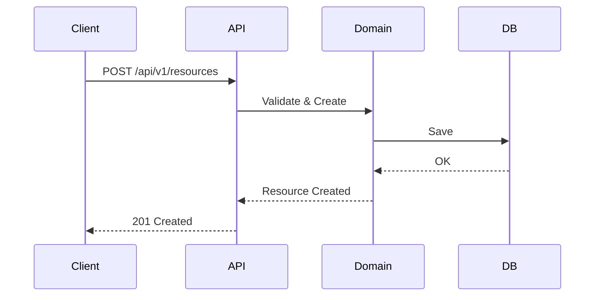
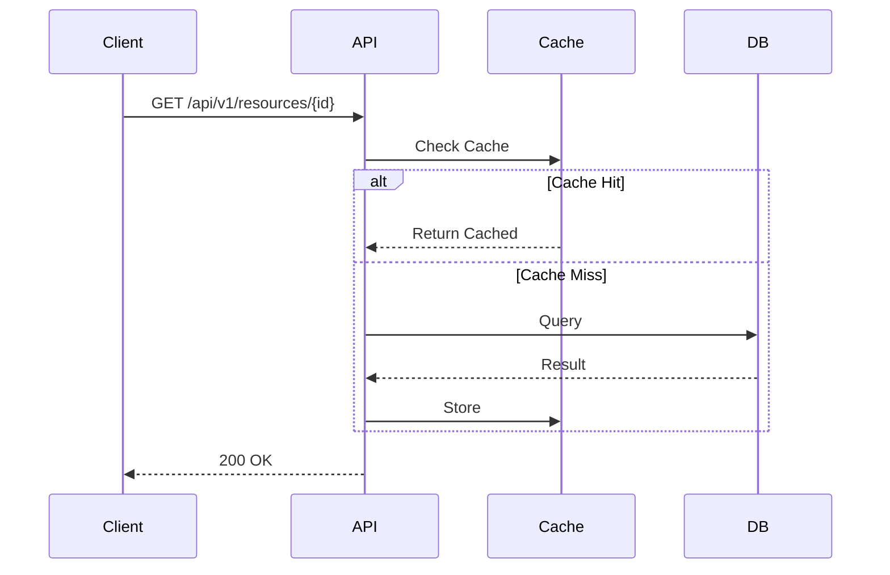
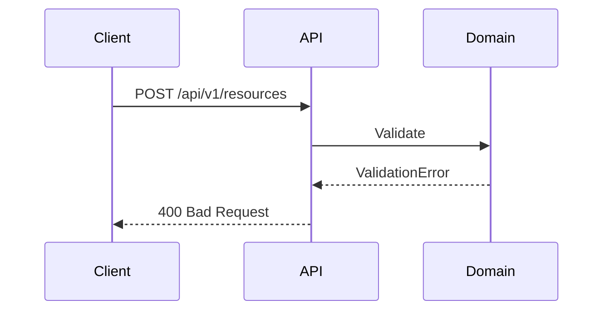

# Flujos del Sistema

## Flujo: Crear Recurso

```mermaid
sequenceDiagram
    participant Client
    participant API
    participant Domain
    participant DB

    Client->>API: POST /api/v1/resources
    API->>Domain: Validate & Create
    Domain->>DB: Save
    DB-->>Domain: OK
    Domain-->>API: Resource Created
    API-->>Client: 201 Created
```

## Flujo: Obtener Recurso

```mermaid
sequenceDiagram
    participant Client
    participant API
    participant Cache
    participant DB

    Client->>API: GET /api/v1/resources/{id}
    API->>Cache: Check Cache
    alt Cache Hit
        Cache-->>API: Return Cached
    else Cache Miss
        API->>DB: Query
        DB-->>API: Result
        API->>Cache: Store
    end
    API-->>Client: 200 OK
```

## Flujo de Errores

```mermaid
sequenceDiagram
    participant Client
    participant API
    participant Domain

    Client->>API: POST /api/v1/resources
    API->>Domain: Validate
    Domain-->>API: ValidationError
    API-->>Client: 400 Bad Request
```
