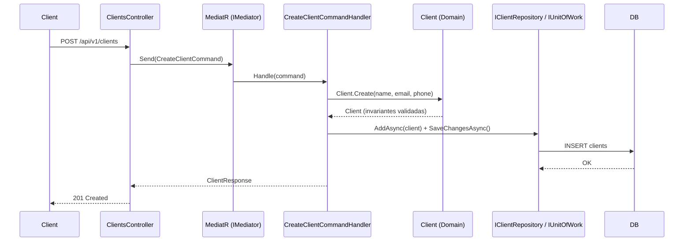
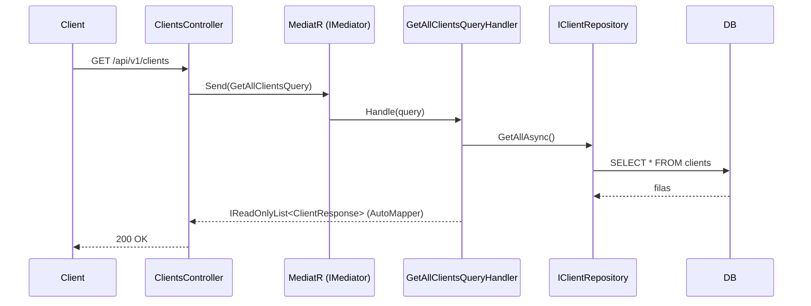
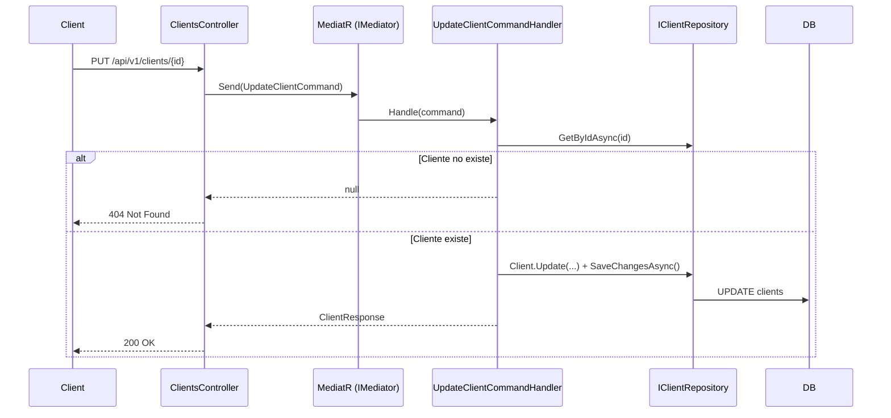
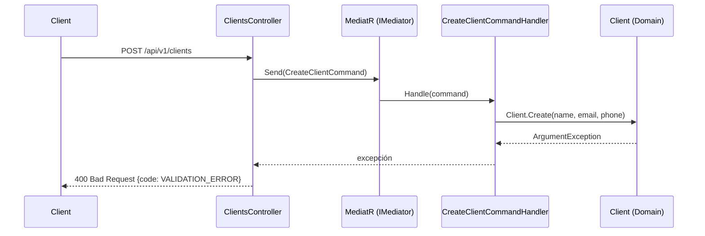

# Flujos del Sistema

## Flujo: Crear Cliente (Command)

## Flujo: Obtener Cliente (Query)

## Flujo: Actualizar / Eliminar Cliente (Command)

`DELETE` sigue el mismo flujo, pero el handler lanza `ClientNotFoundException` cuando no existe y el controller devuelve 404; en caso contrario 204 No Content.

## Flujo de Errores

| Excepción | Origen | Respuesta HTTP |
|-----------|--------|----------------|
| `ArgumentException` | `Client` (Domain) | 400 `{code: "VALIDATION_ERROR"}` |
| `ClientNotFoundException` | Handlers de Application | 404 |
